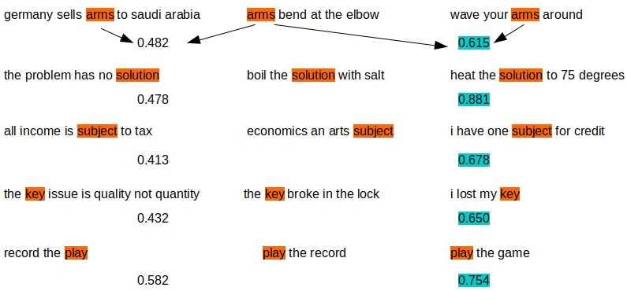

# Bow to Bert

07/10/2023

NOTE: The code here has been updated to work with current versions of Tensorflow/Pytorch engaged from the transformers module. It is in its own repo at [context-aware-word-vectors](https://github.com/ashokc/context-aware-word-vectors)

==========================================================================

Evolution of word vectors from long, sparse, and one-hot to short, dense, and context sensitive

This is the source code to go along with the blog article

[Bow to Bert](http://xplordat.com/2019/09/23/bow-to-bert/)

*Figure 3. BERT embeddings are contextual. Each row show three sentences. The sentence in the middle expresses the same context as the sentence on its right, but different from the one on its left. All three sentences in the row have a word in common. The numbers show the computed cosine-similarity between the indicated word pairs. BERT embedding for the word in the middle is more similar to the same word on the right than the one on the left.*

##  Summary

Word vectors have evolved over the years to know the difference between "record the play" vs "play the record". They have evolved from a one-hot world where every word was orthogonal to every other word, to a place where word vectors morph to suit the context. Slapping a BoW on word vectors is the usual way to build a document vector for tasks such as classification. But BERT does not need a BoW as the vector shooting out of the top [CLS] token is already fine tuned for the specific classification objective...

##	Dependencies
	tensorflow
	numpy

## To reproduce the resuts in the post

Download: [crawl-300d-2M-subword.vec](https://dl.fbaipublicfiles.com/fasttext/vectors-english/crawl-300d-2M-subword.zip)

Download: [BERT-Base, Uncased](https://storage.googleapis.com/bert_models/2018_10_18/uncased_L-12_H-768_A-12.zip)

	Edit the script getBertWordVectors.sh and update path accordingly
		BERT_BASE_DIR="$PRE_TRAINED_HOME/bert/uncased_L-12_H-768_A-12"
	Edit the scripts fasttext_sentence_similarity.py & fasttext_word_similarity.py  and update path accordingly
		filename = os.environ["PRE_TRAINED_HOME"] + '/fasttext/crawl-300d-2M-subword.vec'

### Get BERT word embeddings for the words/sentences in bert_sentences.txt

	./getBertWordVectors.sh

### Process BERT embeddings to compute cosine similarity for context sensitive words

	pipenv run python bert_similarity.py

to get output like:

	arms bend at the elbow  <=>  germany sells arms to saudi arabia 			<=>  0.482
	arms bend at the elbow  <=>  wave your arms around 						<=>  0.615
	

### Fasttext word similarity

	pipenv run python ./fasttext_word_similarity.py holiday vacation paper

to get output like:

	Cosine Similarity: holiday & vacation : 0.7388389
	Cosine Similarity: holiday & paper : 0.2716892
	Cosine Similarity: vacation & paper : 0.27176374

### Fasttext sentence similarity

	pipenv run python ./fasttext_sentence_similarity.py

to get output like:

	words not found in fasttext.. 0

	Cosine Similarity: enjoy your holiday & have a fun vacation : 0.72311985
	Cosine Similarity: enjoy your holiday & study the paper : 0.5743288
	Cosine Similarity: have a fun vacation & study the paper : 0.51478416

